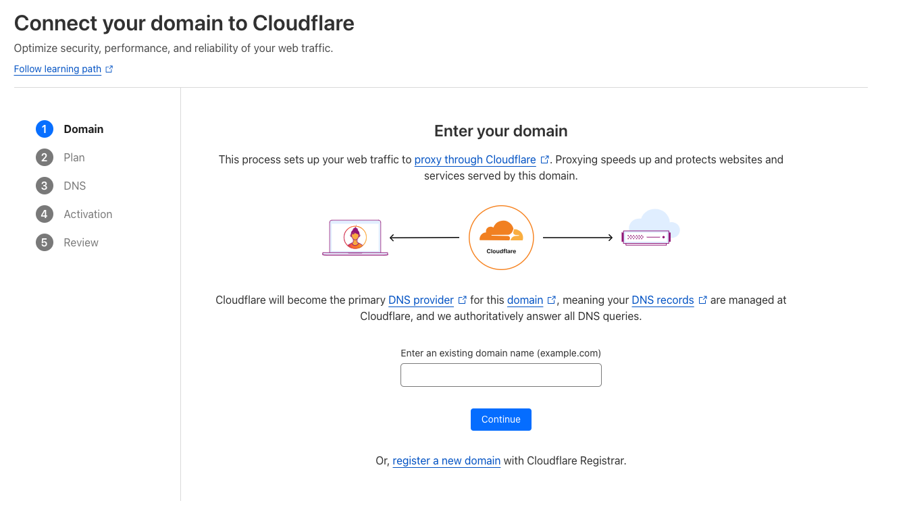
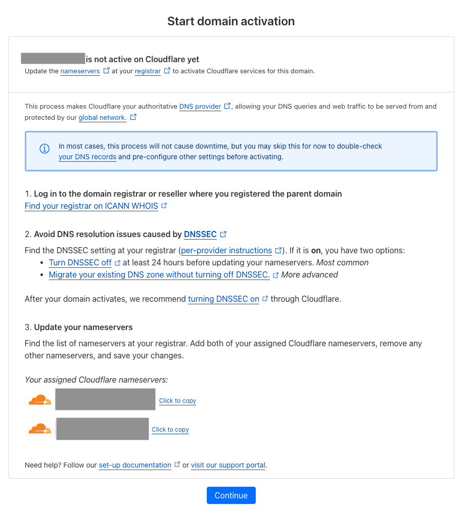
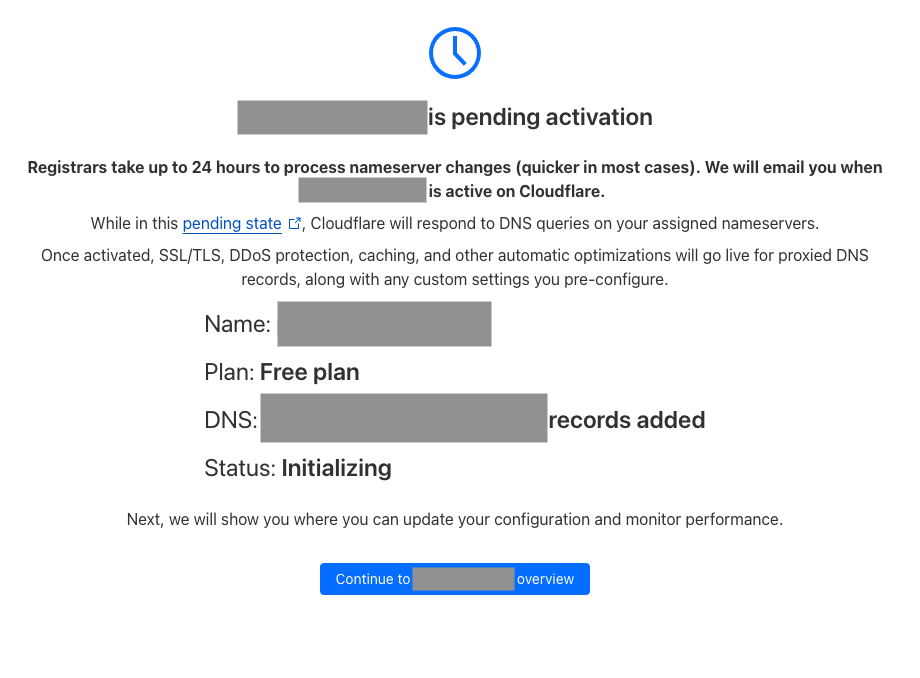
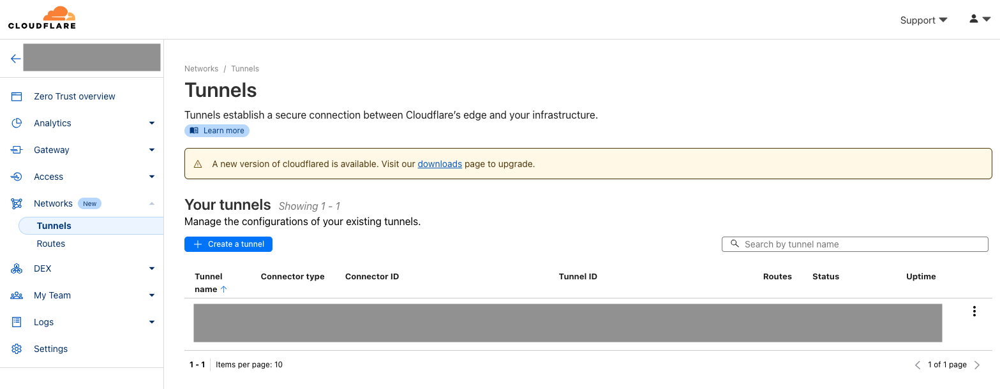
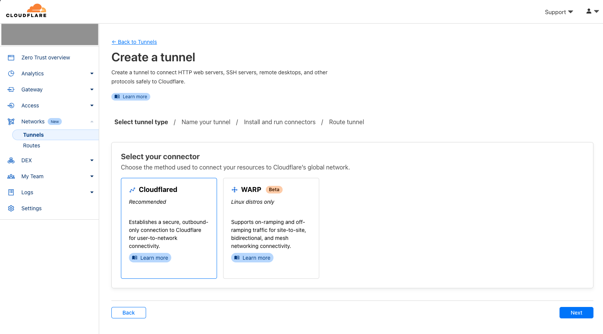
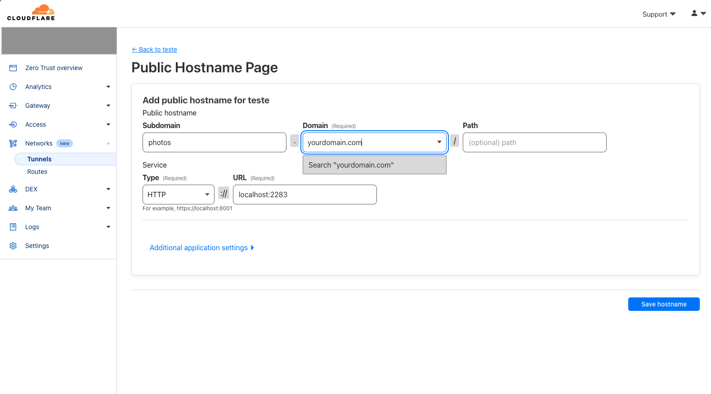

# Access Your Local Immich Installation Over the Internet Using Your Own Domain

In this guide, you will learn how to open your local installation of Immich to the internet using your own domain, even if you're behind Carrier-Grade NAT (CGNAT), which means your Internet Service Provider (ISP) assigns you a shared public IP address. To work around this issue, we will use Cloudflare (the free plan is sufficient) to create a tunnel from the internet to your machine, enabling you to use `subdomain.yourdomain.tld` to access Immich.

> :warning: *Cloudflare's free plan has a payload size [limit of 100MB](https://developers.cloudflare.com/workers/platform/limits/). Uploading files larger than this limit **will not work** over the internet. You can still do it on your local network.*

> :pray: *If you notice mistakes or have suggestions to improve this tutorial, feel free to open an issue or a PR.*

## Prerequisites

1. A working installation of Immich on your local machine.
2. A registered domain name.

## Step-by-Step Guide

### 1. Sign Up for Cloudflare and Add Your Domain

1. Go to [Cloudflare](https://www.cloudflare.com/) and sign up for an account.
2. Once signed in, add your domain to Cloudflare. Follow the on-screen instructions to change your domain's nameservers to Cloudflare's nameservers.

3. Assuming you already own a domain that was purchased elsewhere, you'll need to configure its nameservers to Cloudflare. This means Cloudflare DNS will be responsible for translating your domain name into an IP address. Cloudflare provides a great on-screen tutorial explaining this process. Essentially, you copy Cloudflare's nameservers and paste them into your domain's nameserver configuration at your registrar (e.g., GoDaddy).

4. Click on `Continue` and wait for the changes to take effect. This can take up to 24 hours.

### 2. Install Cloudflare Tunnel on Your Local Machine

Now that Cloudflare DNS is managing your domain, you can easily set the IP address it should translate to. If you have a static IP address for your Immich server, simply set it in Cloudflare, and you're done. If you have a dynamic IP address that rotates but is dedicated to you, it's a bit more complicated but still relatively straightforward. You need to set the IP address initially and keep it updated whenever it changes (there are scripts available online and some routers that can automate this).

The problem many of us with a regular home internet contract face is that our ISP assigns us a shared IP address. This means that the IP address seen by the internet is shared among multiple households, making it impossible to set an IP address at the DNS level that uniquely identifies our home server running Immich.

Enter Cloudflare Tunnels! By installing a piece of software from Cloudflare on your server, a connection to Cloudflare is established. This allows Cloudflare to route all requests to your domain directly to your home server and provides free HTTPS encryption.

1. From your cloudflare dashboard, go to `Zero Trust` on the left-side menu.
2. In the Zero Trust section, select `Networks` -> `Tunnels`.

3. Click on `Create tunnel` and select `Cloudflared` as your connector

3. Follow the instructions to name your tunnel, download, and install the connector on your server. Once the connection is established, it should appear immediately on Cloudflare.

4. Create a route for your tunnel. This is where you point your domain (e.g., `photos.yourdomain.com`) to your Immich installation on your local server (`http://localhost:2283`)

And voilà! You should now be able to access your local Immich installation from outside your home network at `https://photos.yourdomain.com`.